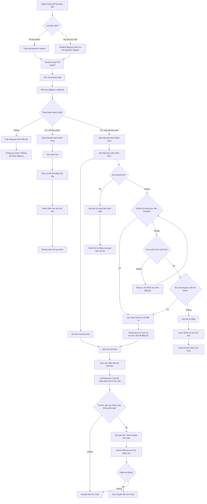
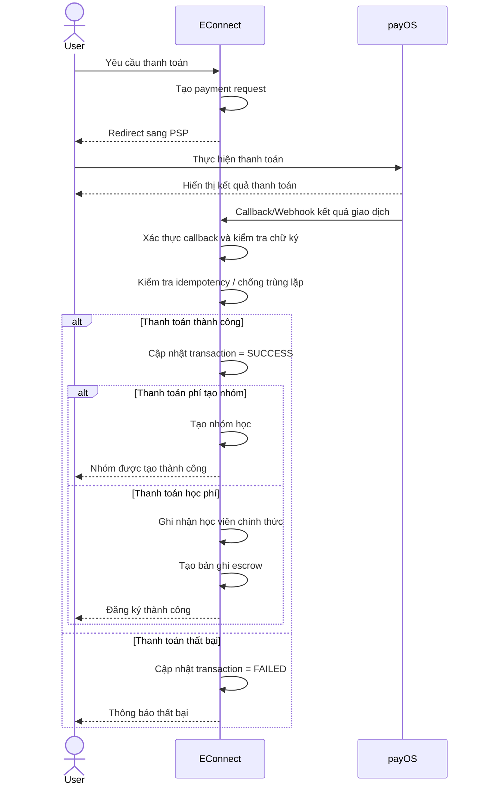
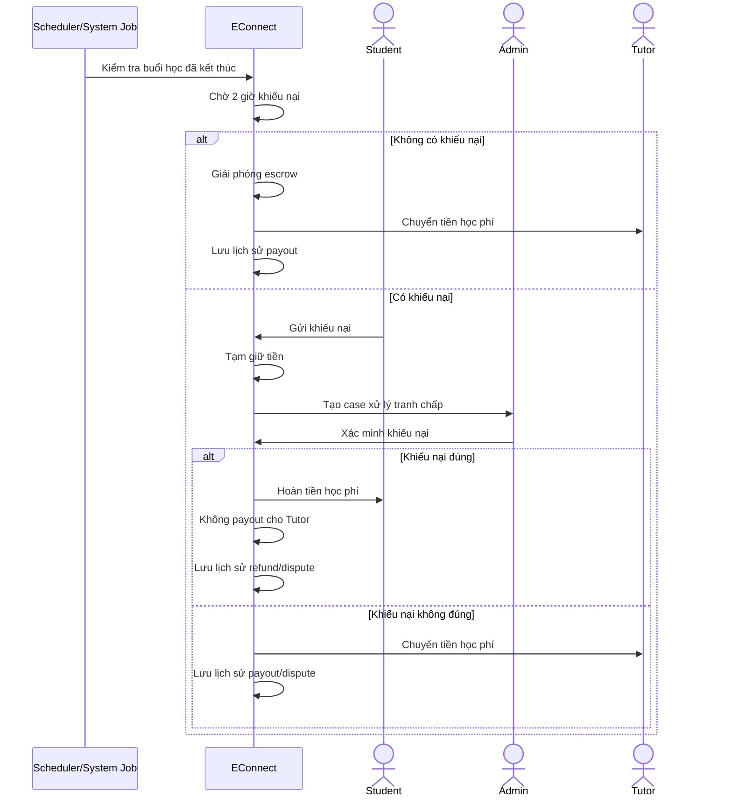
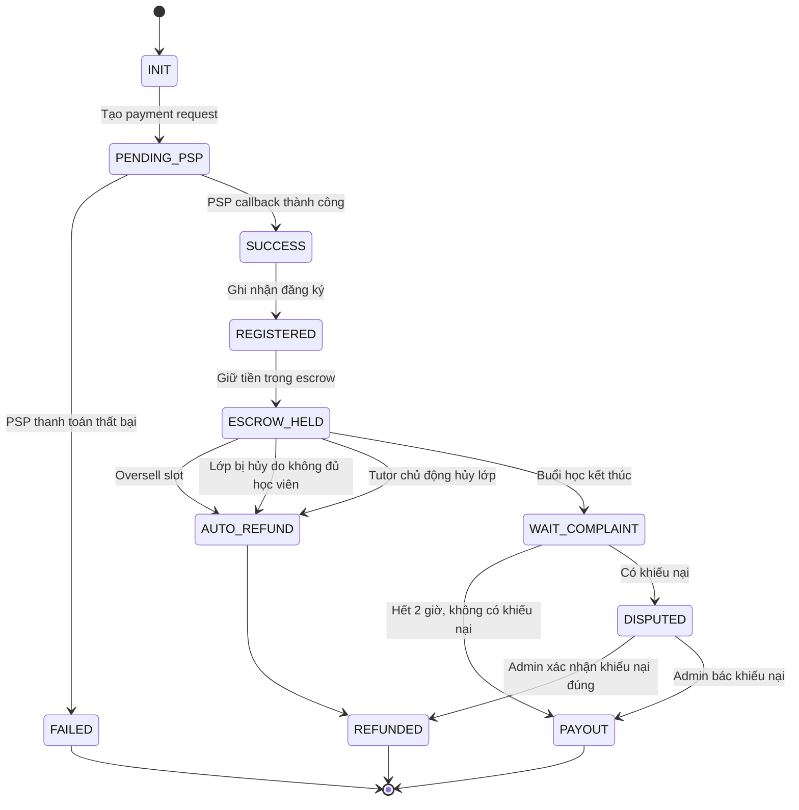
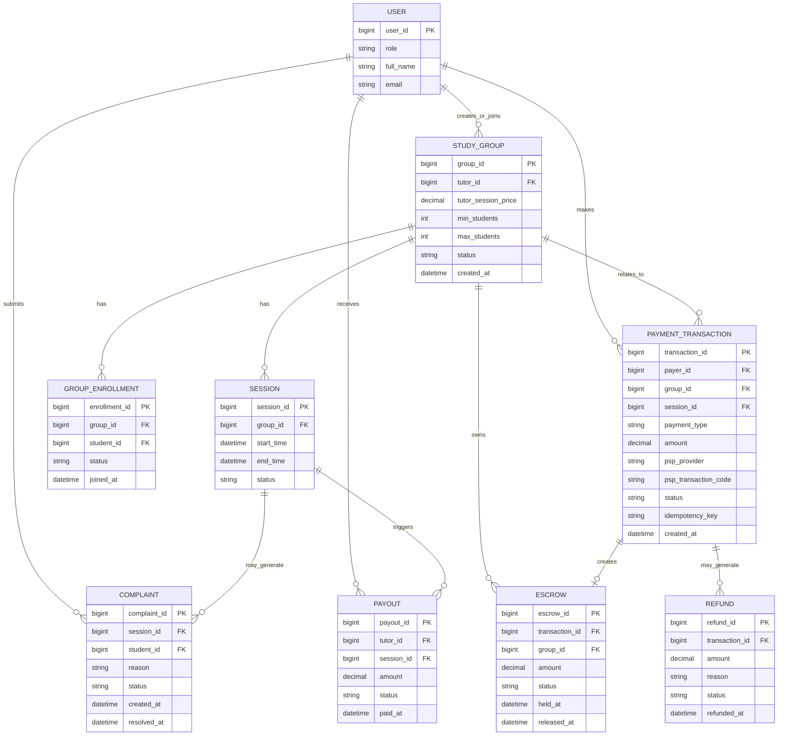
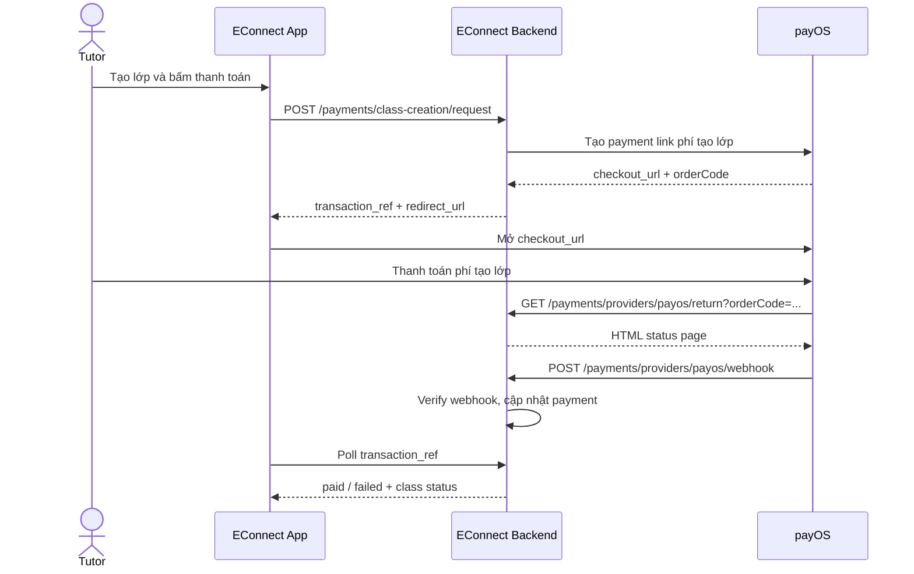
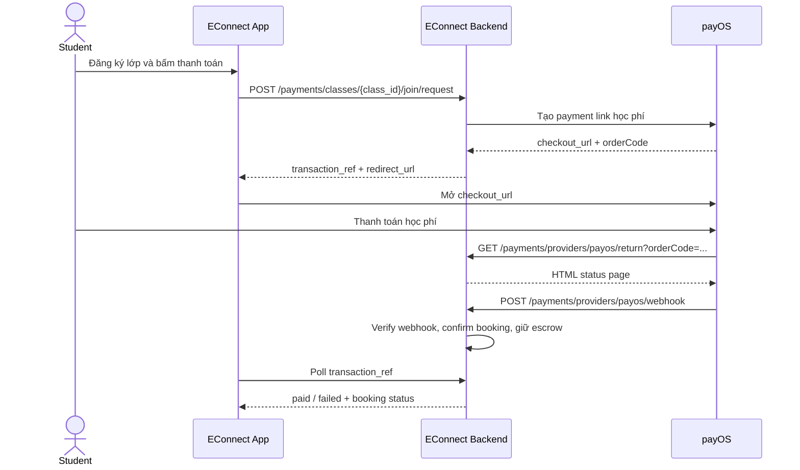
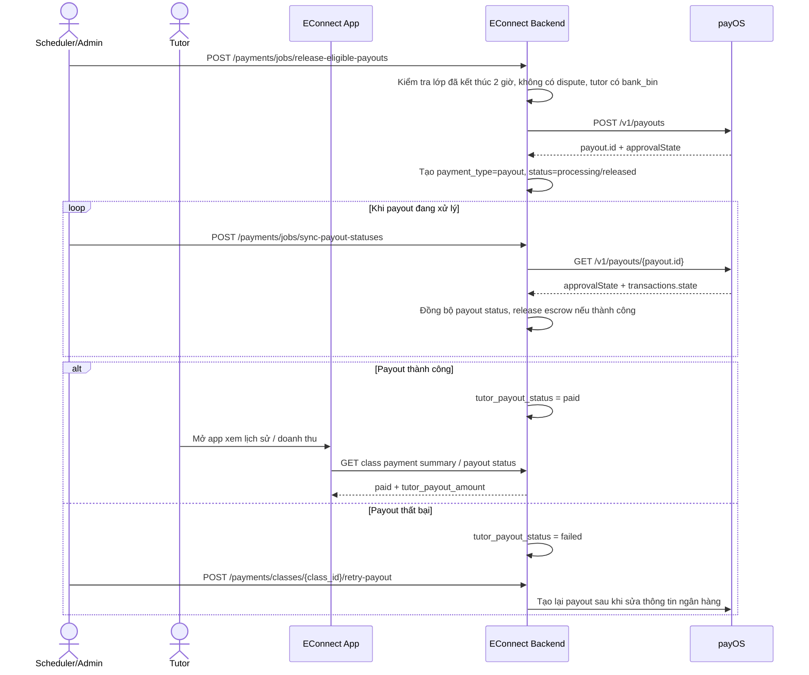

# 1. Bối cảnh và luồng nghiệp vụ tổng quát



# 2. Sơ đồ tuần tự: luồng payment với PSP



# 3. Sơ đồ tuần tự: kết thúc buổi học, escrow, khiếu nại, payout/refund



# 4. Sơ đồ trạng thái: giao dịch học phí và escrow



# 5. ERD: mô hình dữ liệu gợi ý cho tính năng thanh toán



# 6. Ghi chú tích hợp backend với PayOS

- Backend `server/` hiện tại chỉ sử dụng `payOS` cho 2 API tạo giao dịch:
  - `POST /payments/class-creation/request`
  - `POST /payments/classes/{class_id}/join/request`
- Redirect URL trả về cho client sẽ là `checkout_url` do payOS cung cấp.
- Backend nhận redirect người dùng qua `/payments/providers/payos/return` và nhận webhook xác thực qua `/payments/providers/payos/webhook`.
- `transaction_ref` của EConnect vẫn được giữ để app poll trạng thái; `orderCode` của payOS được map vào `payments.provider_order_id`.
- Để bật webhook thật, admin có thể gọi `POST /payments/providers/payos/confirm-webhook` sau khi deploy backend lên URL public.

# 7. Payout cho Tutor qua PayOS

- Sau khi lớp kết thúc 2 giờ và không có khiếu nại, backend gọi `POST /payments/jobs/release-eligible-payouts` để tạo payout cho Tutor qua payOS.
- Nếu lệnh payout vẫn đang chờ xử lý, backend có thể gọi `POST /payments/jobs/sync-payout-statuses` để poll `GET /v1/payouts/{id}` và cập nhật trạng thái nội bộ.
- Tutor phải có đủ `bank_bin` và `bank_account_number` trong profile; nếu thiếu, backend sẽ đánh dấu payout là `failed`.
- Khi đã bổ sung lại thông tin ngân hàng hoặc muốn thử lại sau lỗi tạm thời, admin gọi `POST /payments/classes/{class_id}/retry-payout`.
- `GET /payments/providers/payos/payout-account/balance` giúp admin kiểm tra số dư payout account trước khi chạy lệnh chi.

# 8. Luồng tương tác giữa app, backend và payOS

## 8.1 Tutor đóng phí tạo lớp



## 8.2 Học viên đóng học phí



## 8.3 Backend chi tiền cho Tutor qua payOS



# 9. Quy tắc tính tiền trong hệ thống

## 9.1 Phí tạo lớp của Tutor

- Backend tính phí tạo lớp bằng công thức:

```text
creation_fee_amount = round_half_up(class.price * 10%)
```

- `class.price` là tổng giá trị buổi học mà Tutor đặt cho cả lớp.
- Số tiền này được lưu vào `classes.creation_fee_amount`.
- Payment này là giao dịch `payment_type = class_creation`.
- Nếu Tutor thanh toán thành công thì lớp mới được kích hoạt sang trạng thái `scheduled`.

Ví dụ:

```text
class.price = 200000
creation_fee_amount = 200000 * 10% = 20000
```

## 9.2 Học phí mỗi học viên

- Backend tính học phí mỗi học viên bằng công thức:

```text
student_tuition = round_half_up(class.price / class.max_participants)
```

- Đây là mức học phí mỗi học viên trả cho EConnect khi join lớp.
- Student app nên hiển thị đúng mức này ở card/detail/payment CTA.
- Tutor app vẫn nên hiển thị `class.price` là tổng học phí của cả buổi.
- Các booking trong cùng một lớp sẽ có cùng `tuition_amount` nếu `class.price` và `max_participants` không đổi.
- Payment này là giao dịch `payment_type = tuition`.

Ví dụ:

```text
class.price = 200000
class.max_participants = 4
student_tuition = 200000 / 4 = 50000
```

Nếu lớp có 3 học viên thanh toán thành công thì tổng tiền EConnect đã thu cho lớp đó là:

```text
3 * 50000 = 150000
```

## 9.3 Sau khi học viên thanh toán thành công

Khi callback/webhook xác nhận payment học phí thành công:

- `payments.status = paid`
- `bookings.status = confirmed`
- `bookings.payment_status = paid`
- `bookings.escrow_status = held`
- Tiền được giữ trong escrow của EConnect, chưa chuyển ngay cho Tutor

Nếu xảy ra race condition và lớp đã hết chỗ:

- giao dịch đến sau có thể bị oversell
- booking đó sẽ bị refund tự động
- khoản tiền đã refund không được tính vào payout cho Tutor

# 10. Quy tắc tính payout cho Tutor

## 10.1 Điều kiện tạo payout

Backend chỉ tạo payout cho Tutor khi tất cả điều kiện sau đều đúng:

- Lớp đã kết thúc ít nhất 2 giờ
- Lớp không có khiếu nại đang mở
- Tutor đã cập nhật đủ thông tin `bank_bin` và `bank_account_number`
- Vẫn còn escrow hợp lệ đang được giữ cho lớp đó

## 10.2 Công thức payout

Số tiền payout cho Tutor phải bằng đúng tổng số tiền mà các học viên hợp lệ đã đóng trước đó cho EConnect và vẫn còn đang bị giữ escrow cho lớp.

Công thức nghiệp vụ:

```text
tutor_payout_amount
  = tổng các payment tuition hợp lệ, hiện hành, chưa refund
```

Trong implementation hiện tại, chỉ các khoản sau mới được tính vào payout:

- `Booking.status` là `confirmed` hoặc `completed`
- `Booking.payment_status = paid`
- `Booking.escrow_status = held`
- `Payment.payment_type = tuition`
- `Payment.status = paid`
- `Payment.transaction_ref` phải khớp với `Booking.payment_reference` hiện tại

Điều này rất quan trọng vì nó loại bỏ:

- các giao dịch học phí cũ đã fail
- các giao dịch học phí cũ đã bị thay thế bởi payment mới
- các khoản đã refund
- các booking không còn hợp lệ để trả tiền cho Tutor

## 10.3 Ví dụ payout

Ví dụ lớp có:

- `class.price = 200000`
- `max_participants = 4`
- mỗi học viên đóng `50000`

Tình huống:

- 3 học viên thanh toán thành công
- 1 học viên chưa đóng
- 1 giao dịch cũ của học viên A từng fail trước đó

Khi đó:

```text
Tổng tiền EConnect đã thu hợp lệ = 3 * 50000 = 150000
Payout cho Tutor = 150000
```

Giao dịch fail của học viên A không được cộng vào payout.

## 10.4 Sau khi payout thành công

Khi payOS xác nhận payout thành công:

- `classes.tutor_payout_status = paid`
- `classes.tutor_payout_amount` được cập nhật bằng số tiền đã release thực tế
- `classes.tutor_paid_at` được gán thời điểm chi tiền
- Mỗi booking escrow hợp lệ trong lớp được chuyển sang:

```text
booking.status = completed
booking.escrow_status = released
payment.status = released
```

## 10.5 Khi nào Tutor không nhận đủ số tiền lý thuyết

Payout có thể nhỏ hơn tổng lý thuyết `class.price` trong các trường hợp:

- Chưa đủ học viên thanh toán thành công
- Số lượng học viên đăng ký thành công thấp hơn `max_participants` mà Tutor đã set khi tạo nhóm. Trong trường hợp lớp vẫn đạt `min_participants`, Tutor xác nhận dạy và buổi học vẫn diễn ra, hệ thống chỉ payout theo tổng tiền thực tế đã thu từ các học viên đã đăng ký thành công; các chỗ còn trống không phát sinh `tuition_amount` nên không được cộng vào `tutor_payout_amount`
- Một hoặc nhiều booking đã bị refund
- Có booking bị xác nhận khiếu nại hợp lệ
- Có học viên từng tạo payment nhưng payment đó fail hoặc bị thay thế bằng payment khác

Nói cách khác:

- `class.price` là giá trị mục tiêu của cả lớp
- `tutor_payout_amount` là số tiền thực tế đủ điều kiện để chi cho Tutor

# 11. Các field cần theo dõi trên app/admin

Để hiển thị đúng thông tin payment và payout, app/admin nên ưu tiên các field sau:

- `classes.creation_fee_amount`: phí tạo lớp
- `bookings.tuition_amount`: học phí của từng học viên
- `payments.amount`: số tiền của từng giao dịch
- `payments.status`: trạng thái giao dịch
- `bookings.escrow_status`: trạng thái escrow của booking
- `classes.tutor_payout_status`: trạng thái payout của Tutor
- `classes.tutor_payout_amount`: tổng số tiền sẽ/đã chi cho Tutor
- `payment summary.total_escrow_held`: tổng escrow đang giữ của lớp

Khuyến nghị cách đọc dữ liệu:

- Muốn biết học viên đóng bao nhiêu: đọc `booking.tuition_amount` hoặc `payment.amount` của giao dịch `tuition` hiện hành
- Muốn biết Tutor được nhận bao nhiêu: đọc `classes.tutor_payout_amount`
- Muốn biết lớp còn bao nhiêu tiền đang giữ: đọc `total_escrow_held`
