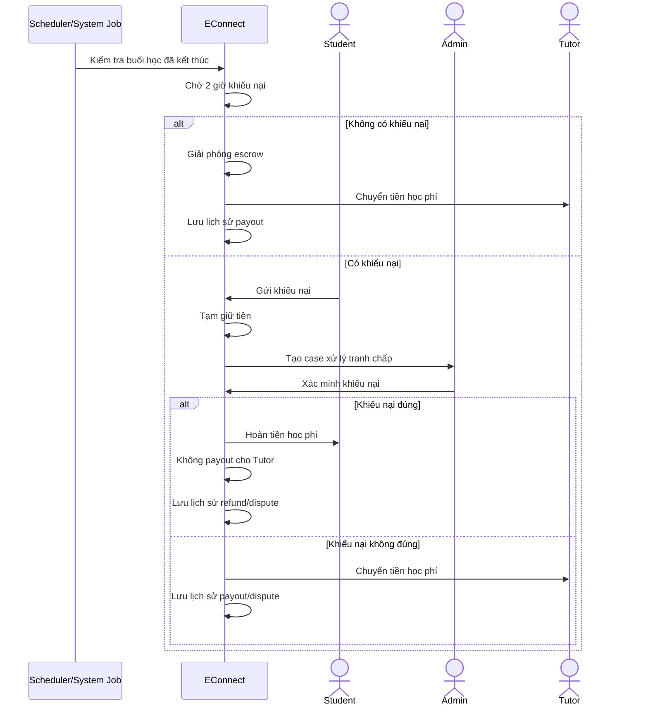

# 1. Context / luồng nghiệp vụ tổng quát

```mermaid
flowchart TD
    A[User khởi tạo giao dịch] --> B{Loại giao dịch?}

    B -->|Phí tạo nhóm| C[Tutor tạo payment request]
    B -->|Học phí học viên| D[Student đăng ký nhóm và tạo payment request]

    C --> E[Redirect sang PSP<br/>MoMo / VNPAY]
    D --> E

    E --> F[PSP xử lý thanh toán]
    F --> G[PSP gửi callback / webhook]

    G --> H{Thanh toán thành công?}

    H -->|No| I[Cập nhật giao dịch thất bại]
    I --> J[Không tạo nhóm / Không ghi nhận đăng ký]

    H -->|Yes - Phí tạo nhóm| K[Cập nhật giao dịch thành công]
    K --> L[Tạo nhóm học]

    H -->|Yes - Học phí học viên| M[Cập nhật giao dịch thành công]
    M --> N[Ghi nhận học viên chính thức]
    N --> O[Giữ tiền trong escrow]

    N --> X{Oversell slot?}
    X -->|Yes| Y[Giữ slot cho giao dịch sớm nhất]
    Y --> Z[Refund tự động các giao dịch còn lại]
    X -->|No| BA{Đã đủ số lượng học viên tối thiểu?}

    BA -->|Yes| BB[Xác nhận buổi học sẽ diễn ra]
    BB --> BC[Thông báo cho Tutor và các học viên đã đăng ký]

    BA -->|No| AA{Còn 4 giờ trước buổi học?}
    AA -->|No| BD[Tiếp tục chờ thêm học viên đăng ký]
    BD --> BA

    AA -->|Yes| AE{Đủ số lượng học viên tối thiểu?}
    AE -->|Yes| BB
    AE -->|No| AB[Hủy lớp tự động]

    AB --> AC[Hoàn 100% học phí học viên]
    AC -->AF[Hoàn phí tạo nhóm cho Tutor]


    BC --> P[Buổi học kết thúc]
    O --> P

    P --> P1[Tutor xác nhận kết thúc buổi học]
    P1 --> Q[Hệ thống chờ 2 giờ để nhận phản hồi từ học viên]

    Q --> R{Có học viên xác nhận Tutor không đến dạy?}
    R -->|No| S[Chuyển tiền cho Tutor]
    R -->|Yes| T[Tạm giữ tiền, chưa chuyển cho Tutor]

    T --> U[Admin kiểm tra và xử lý khiếu nại]
    U --> V{Khiếu nại đúng?}
    V -->|Yes| W[Hủy chuyển tiền cho Tutor]
    V -->|No| S

    L --> AH[Tutor có thể chủ động hủy lớp]
    AH --> AI[Hoàn 100% học phí học viên]
    AI --> AJ[Không hoàn phí tạo nhóm]
````


# 2. Sequence diagram – Payment flow với PSP

```mermaid
sequenceDiagram
    actor User
    participant E as EConnect
    participant PSP as MoMo/VNPAY

    User->>E: Yêu cầu thanh toán
    E->>E: Tạo payment request
    E-->>User: Redirect sang PSP

    User->>PSP: Thực hiện thanh toán
    PSP-->>User: Hiển thị kết quả thanh toán
    PSP->>E: Callback/Webhook kết quả giao dịch

    E->>E: Xác thực callback + kiểm tra chữ ký
    E->>E: Kiểm tra idempotency / chống trùng lặp

    alt Thanh toán thành công
        E->>E: Cập nhật transaction = SUCCESS
        alt Thanh toán phí tạo nhóm
            E->>E: Tạo nhóm học
            E-->>User: Nhóm được tạo thành công
        else Thanh toán học phí
            E->>E: Ghi nhận học viên chính thức
            E->>E: Tạo bản ghi escrow
            E-->>User: Đăng ký thành công
        end
    else Thanh toán thất bại
        E->>E: Cập nhật transaction = FAILED
        E-->>User: Thông báo thất bại
    end
```

# 3. Sequence diagram – Kết thúc buổi học, escrow, khiếu nại, payout/refund



# 4. State diagram – trạng thái giao dịch học phí / escrow

```mermaid
stateDiagram-v2
    [*] --> INIT

    INIT --> PENDING_PSP: Tạo payment request
    PENDING_PSP --> FAILED: PSP thanh toán thất bại
    PENDING_PSP --> SUCCESS: PSP callback thành công

    SUCCESS --> REGISTERED: Ghi nhận đăng ký
    REGISTERED --> ESCROW_HELD: Giữ tiền trong escrow

    ESCROW_HELD --> AUTO_REFUND: Oversell slot
    ESCROW_HELD --> AUTO_REFUND: Lớp bị hủy do không đủ học viên
    ESCROW_HELD --> AUTO_REFUND: Tutor chủ động hủy lớp

    ESCROW_HELD --> WAIT_COMPLAINT: Buổi học kết thúc
    WAIT_COMPLAINT --> PAYOUT: Hết 2 giờ, không có khiếu nại
    WAIT_COMPLAINT --> DISPUTED: Có khiếu nại

    DISPUTED --> REFUNDED: Admin xác nhận khiếu nại đúng
    DISPUTED --> PAYOUT: Admin bác khiếu nại

    AUTO_REFUND --> REFUNDED

    FAILED --> [*]
    REFUNDED --> [*]
    PAYOUT --> [*]

````

# 5. ERD – mô hình dữ liệu gợi ý cho tính năng thanh toán

```mermaid
erDiagram
    USER ||--o{ STUDY_GROUP : creates_or_joins
    USER ||--o{ PAYMENT_TRANSACTION : makes
    USER ||--o{ COMPLAINT : submits
    USER ||--o{ PAYOUT : receives

    STUDY_GROUP ||--o{ GROUP_ENROLLMENT : has
    STUDY_GROUP ||--o{ SESSION : has
    STUDY_GROUP ||--o{ PAYMENT_TRANSACTION : relates_to
    STUDY_GROUP ||--o{ ESCROW : owns

    SESSION ||--o{ COMPLAINT : may_generate
    SESSION ||--o{ PAYOUT : triggers

    PAYMENT_TRANSACTION ||--o| ESCROW : creates
    PAYMENT_TRANSACTION ||--o{ REFUND : may_generate

    USER {
        bigint user_id PK
        string role
        string full_name
        string email
    }

    STUDY_GROUP {
        bigint group_id PK
        bigint tutor_id FK
        decimal tutor_session_price
        int min_students
        int max_students
        string status
        datetime created_at
    }

    GROUP_ENROLLMENT {
        bigint enrollment_id PK
        bigint group_id FK
        bigint student_id FK
        string status
        datetime joined_at
    }

    SESSION {
        bigint session_id PK
        bigint group_id FK
        datetime start_time
        datetime end_time
        string status
    }

    PAYMENT_TRANSACTION {
        bigint transaction_id PK
        bigint payer_id FK
        bigint group_id FK
        bigint session_id FK
        string payment_type
        decimal amount
        string psp_provider
        string psp_transaction_code
        string status
        string idempotency_key
        datetime created_at
    }

    ESCROW {
        bigint escrow_id PK
        bigint transaction_id FK
        bigint group_id FK
        decimal amount
        string status
        datetime held_at
        datetime released_at
    }

    REFUND {
        bigint refund_id PK
        bigint transaction_id FK
        decimal amount
        string reason
        string status
        datetime refunded_at
    }

    PAYOUT {
        bigint payout_id PK
        bigint tutor_id FK
        bigint session_id FK
        decimal amount
        string status
        datetime paid_at
    }

    COMPLAINT {
        bigint complaint_id PK
        bigint session_id FK
        bigint student_id FK
        string reason
        string status
        datetime created_at
        datetime resolved_at
    }
```