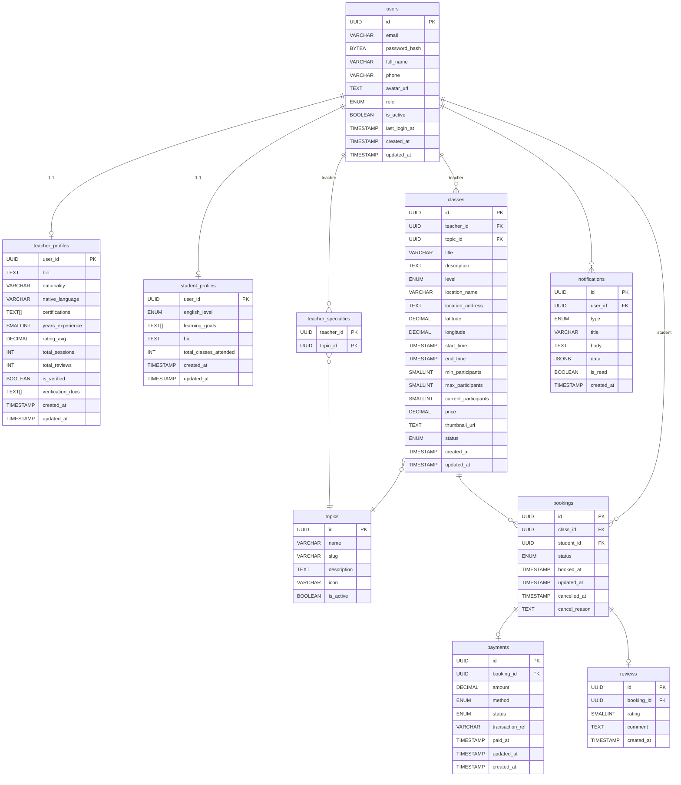

# Sơ Đồ ERD — Cấu Trúc Cơ Sở Dữ Liệu EConnect

> Phiên bản: v1 (MVP)
> Lớp học: chỉ offline
> Hội thoại/Tin nhắn: chưa bao gồm, dự kiến ở v2

---

## Sơ đồ



---

## Các bảng

### users
| Cột | Kiểu | Ghi chú |
|---|---|---|
| id | UUID | PK |
| email | VARCHAR(255) | UNIQUE |
| password_hash | BYTEA | bcrypt hash |
| full_name | VARCHAR(100) | |
| phone | VARCHAR(20) | |
| avatar_url | TEXT | |
| role | ENUM('student','teacher','admin') | |
| is_active | BOOLEAN | |
| last_login_at | TIMESTAMP | |
| created_at | TIMESTAMP | |
| updated_at | TIMESTAMP | |

---

### teacher_profiles
| Cột | Kiểu | Ghi chú |
|---|---|---|
| user_id | UUID | PK, FK → users.id |
| bio | TEXT | |
| nationality | VARCHAR(50) | |
| native_language | VARCHAR(50) | |
| certifications | TEXT[] | URL tài liệu chứng chỉ |
| years_experience | SMALLINT | |
| rating_avg | DECIMAL(2,1) | denormalized — đồng bộ với tutor_reviews, làm tròn 1 chữ số thập phân |
| total_sessions | INT | denormalized |
| total_reviews | INT | denormalized — COUNT(tutor_reviews) |
| is_verified | BOOLEAN | |
| verification_docs | TEXT[] | URL tài liệu đã upload |
| created_at | TIMESTAMP | |
| updated_at | TIMESTAMP | |

> `user_id` là PK, tương ứng quan hệ 1-1 với `users`, nên không cần surrogate id riêng.

---

### student_profiles
| Cột | Kiểu | Ghi chú |
|---|---|---|
| user_id | UUID | PK, FK → users.id |
| english_level | ENUM('beginner','intermediate','advanced') | |
| learning_goals | TEXT[] | |
| bio | TEXT | |
| total_classes_attended | INT | denormalized |
| created_at | TIMESTAMP | |
| updated_at | TIMESTAMP | |

> `user_id` là PK, tương ứng quan hệ 1-1 với `users`, nên không cần surrogate id riêng.

---

### topics
| Cột | Kiểu | Ghi chú |
|---|---|---|
| id | UUID | PK |
| name | VARCHAR(100) | |
| slug | VARCHAR(100) | UNIQUE |
| description | TEXT | |
| icon | VARCHAR(10) | emoji hoặc tên icon |
| is_active | BOOLEAN | |

---

### teacher_specialties
| Cột | Kiểu | Ghi chú |
|---|---|---|
| teacher_id | UUID | PK, FK → users.id |
| topic_id | UUID | PK, FK → topics.id |

> Composite PK (`teacher_id`, `topic_id`). Đây là junction table, không cần surrogate key.

---

### classes
| Cột | Kiểu | Ghi chú |
|---|---|---|
| id | UUID | PK |
| teacher_id | UUID | FK → users.id |
| topic_id | UUID | FK → topics.id |
| title | VARCHAR(200) | |
| description | TEXT | |
| level | ENUM('beginner','intermediate','advanced') | |
| location_name | VARCHAR(200) | tên địa điểm |
| location_address | TEXT | địa chỉ đầy đủ |
| latitude | DECIMAL(10,8) | |
| longitude | DECIMAL(10,7) | |
| start_time | TIMESTAMP | |
| end_time | TIMESTAMP | |
| min_participants | SMALLINT | số học viên tối thiểu để lớp diễn ra |
| max_participants | SMALLINT | |
| current_participants | SMALLINT | denormalized — đồng bộ với bookings |
| price | DECIMAL(10,0) | VND |
| thumbnail_url | TEXT | có thể để trống — MinIO URL |
| status | ENUM('scheduled','ongoing','completed','cancelled') | |
| created_at | TIMESTAMP | |
| updated_at | TIMESTAMP | |

> `current_participants` là trường denormalized. Cần cập nhật transactional cùng với insert/cancel booking.

---

### bookings
| Cột | Kiểu | Ghi chú |
|---|---|---|
| id | UUID | PK |
| class_id | UUID | FK → classes.id |
| student_id | UUID | FK → users.id |
| status | ENUM('pending','confirmed','completed','cancelled','no_show') | |
| booked_at | TIMESTAMP | |
| updated_at | TIMESTAMP | |
| cancelled_at | TIMESTAMP | có thể để trống |
| cancel_reason | TEXT | có thể để trống |

**Luồng booking:**
```
pending → (payment success) → confirmed → (class ends) → completed
        → (student cancel)  → cancelled
        → (student no-show) → no_show
```

**Ràng buộc:**
- UNIQUE (`class_id`, `student_id`) để tránh đặt trùng

---

### payments
| Cột | Kiểu | Ghi chú |
|---|---|---|
| id | UUID | PK |
| booking_id | UUID | FK → bookings.id |
| amount | DECIMAL(10,0) | VND |
| method | ENUM('zalopay','bank_transfer','cash') | |
| status | ENUM('pending','completed','refunded','failed') | |
| transaction_ref | VARCHAR(100) | có thể để trống — ref từ payment gateway |
| paid_at | TIMESTAMP | có thể để trống |
| updated_at | TIMESTAMP | |
| created_at | TIMESTAMP | |

---

### tutor_reviews
| Cột | Kiểu | Ghi chú |
|---|---|---|
| id | UUID | PK |
| class_id | UUID | FK → classes.id |
| booking_id | UUID | FK → bookings.id |
| teacher_id | UUID | FK → users.id |
| student_id | UUID | FK → users.id |
| rating | SMALLINT | 0–5 |
| comment | TEXT | tối đa 100 từ ở application layer |
| created_at | TIMESTAMP | |
| updated_at | TIMESTAMP | |

> Implementation hiện tại giữ thêm `class_id`, `teacher_id`, `student_id` để query nhanh hơn khi lấy rating/review theo tutor hoặc theo buổi học.

**Ràng buộc:**
- UNIQUE (`booking_id`) để mỗi booking chỉ có một review
- UNIQUE (`class_id`, `student_id`) để mỗi học viên chỉ đánh giá một lần cho mỗi buổi học

---

### notifications
| Cột | Kiểu | Ghi chú |
|---|---|---|
| id | UUID | PK |
| user_id | UUID | FK → users.id |
| type | ENUM('booking','reminder','review','system') | |
| title | VARCHAR(200) | |
| body | TEXT | |
| data | JSONB | payload linh hoạt theo từng type |
| is_read | BOOLEAN | |
| created_at | TIMESTAMP | |

> `'message'` đã được bỏ khỏi ENUM, sẽ thêm lại ở v2 cùng với conversations.

---

## Quan hệ

```
users 1──1 teacher_profiles
users 1──1 student_profiles

users (teacher) ──< teacher_specialties >── topics
users (teacher) 1──< classes >── topics

classes 1──< bookings
users (student) 1──< bookings

bookings 1──1 payments
bookings 1──1 tutor_reviews

users 1──< notifications
```

---

## Tạm hoãn cho v2+

| Tính năng | Bảng |
|---|---|
| Chat | conversations, messages |

---

## Các trường denormalized

Cần đồng bộ bằng application logic hoặc DB trigger:

| Bảng | Trường | Nguồn dữ liệu gốc |
|---|---|---|
| teacher_profiles | rating_avg | ROUND(AVG(tutor_reviews.rating), 1) |
| teacher_profiles | total_sessions | COUNT(bookings) với status = completed |
| teacher_profiles | total_reviews | COUNT(tutor_reviews) |
| student_profiles | total_classes_attended | COUNT(bookings) với status = completed |
| classes | current_participants | COUNT(bookings) với status != cancelled |

### Quy tắc tính rating tutor

- Mỗi học viên chỉ có tối đa `1` review cho mỗi buổi học đã đăng ký và thanh toán.
- Review chỉ được gửi sau khi buổi học kết thúc.
- Điểm rating của tutor dùng thang `0` đến `5` sao.
- `teacher_profiles.rating_avg = ROUND(AVG(tutor_reviews.rating), 1)`.
- `teacher_profiles.total_reviews = COUNT(tutor_reviews)` của tutor.
- Khi học viên cập nhật review cũ, hệ thống tính lại toàn bộ `rating_avg` và `total_reviews` từ dữ liệu review hiện có.
