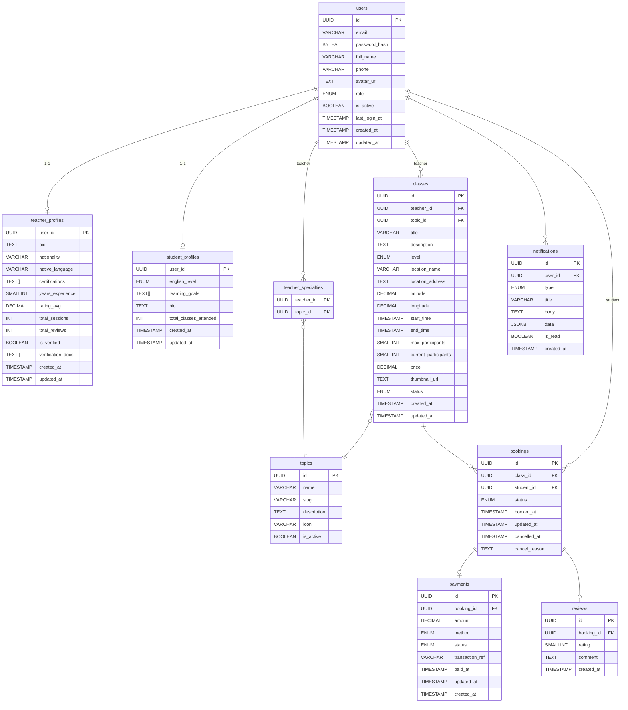

# ERD — EConnect Database Schema

> Version: v1 (MVP)
> Classes: offline only
> Conversations/Messages: excluded — planned for v2

---

## Diagram



---

## Tables

### users
| Column | Type | Notes |
|---|---|---|
| id | UUID | PK |
| email | VARCHAR(255) | UNIQUE |
| password_hash | BYTEA | bcrypt hash |
| full_name | VARCHAR(100) | |
| phone | VARCHAR(20) | |
| avatar_url | TEXT | |
| role | ENUM('student','teacher','admin') | |
| is_active | BOOLEAN | |
| last_login_at | TIMESTAMP | |
| created_at | TIMESTAMP | |
| updated_at | TIMESTAMP | |

---

### teacher_profiles
| Column | Type | Notes |
|---|---|---|
| user_id | UUID | PK, FK → users.id |
| bio | TEXT | |
| nationality | VARCHAR(50) | |
| native_language | VARCHAR(50) | |
| certifications | TEXT[] | URLs to cert documents |
| years_experience | SMALLINT | |
| rating_avg | DECIMAL(2,1) | denormalized — sync với reviews |
| total_sessions | INT | denormalized |
| total_reviews | INT | denormalized |
| is_verified | BOOLEAN | |
| verification_docs | TEXT[] | URLs to uploaded documents |
| created_at | TIMESTAMP | |
| updated_at | TIMESTAMP | |

> `user_id` là PK (quan hệ 1-1 với users, không cần surrogate id riêng)

---

### student_profiles
| Column | Type | Notes |
|---|---|---|
| user_id | UUID | PK, FK → users.id |
| english_level | ENUM('beginner','intermediate','advanced') | |
| learning_goals | TEXT[] | |
| bio | TEXT | |
| total_classes_attended | INT | denormalized |
| created_at | TIMESTAMP | |
| updated_at | TIMESTAMP | |

> `user_id` là PK (quan hệ 1-1 với users, không cần surrogate id riêng)

---

### topics
| Column | Type | Notes |
|---|---|---|
| id | UUID | PK |
| name | VARCHAR(100) | |
| slug | VARCHAR(100) | UNIQUE |
| description | TEXT | |
| icon | VARCHAR(10) | emoji hoặc icon name |
| is_active | BOOLEAN | |

---

### teacher_specialties
| Column | Type | Notes |
|---|---|---|
| teacher_id | UUID | PK, FK → users.id |
| topic_id | UUID | PK, FK → topics.id |

> Composite PK (teacher_id, topic_id). Junction table — không cần surrogate key.

---

### classes
| Column | Type | Notes |
|---|---|---|
| id | UUID | PK |
| teacher_id | UUID | FK → users.id |
| topic_id | UUID | FK → topics.id |
| title | VARCHAR(200) | |
| description | TEXT | |
| level | ENUM('beginner','intermediate','advanced') | |
| location_name | VARCHAR(200) | tên địa điểm |
| location_address | TEXT | địa chỉ đầy đủ |
| latitude | DECIMAL(10,8) | |
| longitude | DECIMAL(10,7) | |
| start_time | TIMESTAMP | |
| end_time | TIMESTAMP | |
| max_participants | SMALLINT | |
| current_participants | SMALLINT | denormalized — sync với bookings |
| price | DECIMAL(10,0) | VND |
| thumbnail_url | TEXT | nullable — MinIO URL |
| status | ENUM('scheduled','ongoing','completed','cancelled') | |
| created_at | TIMESTAMP | |
| updated_at | TIMESTAMP | |

> `current_participants` là denormalized. Phải cập nhật transactional cùng với insert/cancel booking.

---

### bookings
| Column | Type | Notes |
|---|---|---|
| id | UUID | PK |
| class_id | UUID | FK → classes.id |
| student_id | UUID | FK → users.id |
| status | ENUM('pending','confirmed','completed','cancelled','no_show') | |
| booked_at | TIMESTAMP | |
| updated_at | TIMESTAMP | |
| cancelled_at | TIMESTAMP | nullable |
| cancel_reason | TEXT | nullable |

**Booking flow:**
```
pending → (payment success) → confirmed → (class ends) → completed
        → (student cancel)  → cancelled
        → (student no-show) → no_show
```

**Constraints:**
- UNIQUE (class_id, student_id) — tránh đặt trùng

---

### payments
| Column | Type | Notes |
|---|---|---|
| id | UUID | PK |
| booking_id | UUID | FK → bookings.id |
| amount | DECIMAL(10,0) | VND |
| method | ENUM('zalopay','bank_transfer','cash') | |
| status | ENUM('pending','completed','refunded','failed') | |
| transaction_ref | VARCHAR(100) | nullable — ref từ payment gateway |
| paid_at | TIMESTAMP | nullable |
| updated_at | TIMESTAMP | |
| created_at | TIMESTAMP | |

---

### reviews
| Column | Type | Notes |
|---|---|---|
| id | UUID | PK |
| booking_id | UUID | FK → bookings.id |
| rating | SMALLINT | 1–5 |
| comment | TEXT | |
| created_at | TIMESTAMP | |

> `student_id`, `teacher_id`, `class_id` được bỏ — đều suy ra từ `booking_id` để tránh inconsistency.

**Constraints:**
- UNIQUE (booking_id) — mỗi booking chỉ được 1 review

---

### notifications
| Column | Type | Notes |
|---|---|---|
| id | UUID | PK |
| user_id | UUID | FK → users.id |
| type | ENUM('booking','reminder','review','system') | |
| title | VARCHAR(200) | |
| body | TEXT | |
| data | JSONB | flexible payload tùy type |
| is_read | BOOLEAN | |
| created_at | TIMESTAMP | |

> `'message'` đã bỏ khỏi ENUM — sẽ thêm lại ở v2 cùng với conversations.

---

## Relationships

```
users 1──1 teacher_profiles
users 1──1 student_profiles

users (teacher) ──< teacher_specialties >── topics
users (teacher) 1──< classes >── topics

classes 1──< bookings
users (student) 1──< bookings

bookings 1──1 payments
bookings 1──1 reviews

users 1──< notifications
```

---

## Deferred (v2+)

| Feature | Tables |
|---|---|
| Chat | conversations, messages |

---

## Denormalized Fields

Phải sync bằng application logic hoặc DB trigger:

| Table | Field | Source of truth |
|---|---|---|
| teacher_profiles | rating_avg | AVG(reviews.rating) |
| teacher_profiles | total_sessions | COUNT(bookings) status = completed |
| teacher_profiles | total_reviews | COUNT(reviews) |
| student_profiles | total_classes_attended | COUNT(bookings) status = completed |
| classes | current_participants | COUNT(bookings) status != cancelled |
