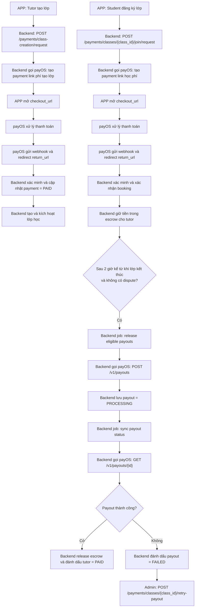

# EConnect Server

Backend FastAPI cho EConnect. Xem hướng dẫn tổng quan tại [README gốc](../README.md).

## Khởi động nhanh

**Trên macOS/Linux:**

```bash
python3 -m venv venv
source venv/bin/activate
pip install -r requirements.txt

uvicorn main:app --host 0.0.0.0 --port 8000 --reload
```

**Trên Windows (PowerShell):**

```powershell
python -m venv venv
.\venv\Scripts\Activate.ps1
pip install -r requirements.txt

uvicorn main:app --host 0.0.0.0 --port 8000 --reload
```

Nếu local Chrome/web không gọi được backend hoặc bị treo loading do còn process `uvicorn` cũ, chạy từ thư mục repo:

```powershell
.\scripts\start-dev-backend.ps1
```

Swagger UI: http://localhost:8000/docs

## Thiết lập môi trường

- Copy `server/.env.example` thành `server/.env` trước khi chạy backend.
- `server/.env.example` là file mẫu để chia sẻ trong repo.
- `server/.env` chứa secret thực tế và đã được thêm vào `.gitignore`, không commit lên git.
- Trên production nên đổi `JWT_SECRET`, `ADMIN_CREATE_SECRET`, `JOB_SECRET`, tắt mock mode, và cấu hình `CORS_ALLOW_ORIGINS` rõ ràng.
- Đặt `APP_ENV=production` và `STRICT_STARTUP_VALIDATION=true` để backend tự chặn các cấu hình nguy hiểm lúc startup.
- Xem checklist chốt release tại [production-checklist.md](../docs/production-checklist.md).
- Trong `APP_ENV=development`, backend tự động cho phép CORS từ `localhost` và `127.0.0.1` mọi port để phù hợp với Flutter web dev server.

## Cổng thanh toán

Backend hiện tại chỉ sử dụng payOS cho payment flow:

- `POST /payments/class-creation/request` để tạo giao dịch phí tạo lớp
- `POST /payments/classes/{class_id}/join/request` để tạo giao dịch học phí
- `GET /payments/providers/payos/return` cho redirect sau khi người dùng thanh toán
- `POST /payments/providers/payos/webhook` cho webhook xác thực từ payOS
- `POST /payments/providers/payos/confirm-webhook` để admin đăng ký webhook URL với payOS
- `GET /payments/providers/payos/payout-account/balance` để admin kiểm tra số dư payout account
- `GET /notifications/cursor` để client lấy inbox theo cursor-based pagination
- `GET /notifications/unread-count` để badge unread cập nhật riêng
- `WS /notifications/ws?token=...` để app nhận tín hiệu inbox thay đổi theo thời gian thực
- `POST /notifications/push-tokens` để client đăng ký FCM device token
- `POST /notifications/push-tokens/unregister` để client hủy đăng ký token khi logout hoặc token đổi
- `POST /payments/jobs/notify-classes-starting-soon` để scheduler gửi thông báo nhắc lịch cho Tutor và học viên trước khoảng 1 giờ
- `POST /payments/jobs/release-eligible-payouts` để tạo lệnh payout cho tutor sau khi hết cửa sổ khiếu nại
- `POST /payments/jobs/sync-payout-statuses` để đồng bộ các lệnh payout đang xử lý
- `POST /payments/classes/{class_id}/retry-payout` để admin tạo lại payout nếu lần trước bị fail

Ba luồng chính của payment/payout:



Cần cấu hình thêm trong `.env`:

```env
JWT_EXPIRE_MINUTES=10080
ALLOW_LEGACY_JWT_SECRET=false
JOB_SECRET=...
APP_ENV=development
STRICT_STARTUP_VALIDATION=false
AUTO_INIT_SCHEMA=true
INTERNAL_JOB_RUNNER_ENABLED=true
INTERNAL_JOB_RUNNER_INTERVAL_SECONDS=60
ALLOW_DIRECT_CLASS_CREATION=false
CORS_ALLOW_ORIGINS=http://localhost:3000,http://127.0.0.1:3000
CORS_ALLOW_ORIGIN_REGEX=
SERVER_PUBLIC_URL=http://127.0.0.1:8000
PAYMENT_PUBLIC_BASE_URL=http://127.0.0.1:8000
STATIC_PUBLIC_URL=http://127.0.0.1:8000
PAYMENT_GATEWAY_MODE=mock
PAYOS_CLIENT_ID=...
PAYOS_API_KEY=...
PAYOS_CHECKSUM_KEY=...
PAYOS_PARTNER_CODE=
# tùy chọn
PAYOS_BASE_URL=https://api-merchant.payos.vn
PAYOS_TIMEOUT=60
PAYOS_MAX_RETRIES=2

# payout dùng bo credential rieng; hay dien day du khi bat payout that
PAYOS_PAYOUT_CLIENT_ID=...
PAYOS_PAYOUT_API_KEY=...
PAYOS_PAYOUT_CHECKSUM_KEY=...
PAYOS_PAYOUT_PARTNER_CODE=
PAYOS_PAYOUT_BASE_URL=https://api-merchant.payos.vn
PAYOS_PAYOUT_TIMEOUT=60
PAYOS_PAYOUT_MAX_RETRIES=2

# optional: FCM push delivery from backend
FCM_SERVICE_ACCOUNT_PATH=
FCM_SERVICE_ACCOUNT_JSON=
```

### Mock mode

- Khi `PAYMENT_GATEWAY_MODE=mock`, backend sẽ trả `redirect_url` về trang mock checkout nội bộ.
- Trang mock có 2 nút thành công/thất bại và sẽ gọi lại backend như một PSP giả lập.
- Dùng để test end-to-end local cùng client polling mà không cần credential sandbox hay public callback URL.
- Các route mock/manual callback chỉ nên dùng trong mock mode, không mở cho production.

### Lưu ý cho payOS

- Backend đang dùng SDK `payos==1.1.0`.
- `POST /classes` đã bị tắt mặc định để tránh bypass creation fee. Nếu thật sự cần cho dev/test, bật `ALLOW_DIRECT_CLASS_CREATION=true`.
- payOS yêu cầu webhook URL public và cần xác nhận webhook. Có thể gọi `POST /payments/providers/payos/confirm-webhook` bằng token admin để đăng ký webhook URL mặc định (`{PAYMENT_PUBLIC_BASE_URL}/payments/providers/payos/webhook`) hoặc truyền `webhook_url` tùy chọn.
- `transaction_ref` nội bộ của EConnect được giữ nguyên để client poll trạng thái; `orderCode` của payOS được lưu trong `payments.provider_order_id`.
- payment và payout dùng các bộ `client_id`, `api_key`, `checksum_key` riêng. Khi bật payout thật, cần điền `PAYOS_PAYOUT_CLIENT_ID`, `PAYOS_PAYOUT_API_KEY`, `PAYOS_PAYOUT_CHECKSUM_KEY`.
- Payout cho tutor dùng API `POST /v1/payouts` và `GET /v1/payouts/{id}` của payOS. Backend lưu `payout.id` vào `payments.provider_order_id` để job có thể đồng bộ trạng thái payout.
- Các API payout thật như verify tài khoản ngân hàng, payout balance, tạo payout, và sync payout dùng IP public outbound của backend. `ngrok` chỉ giúp webhook/return đi vào local, không thay thế allowlist IP cho payout.
- Nếu payOS trả lỗi `Địa chỉ IP không được phép truy cập hệ thống`, hãy thêm IP public outbound của backend vào `my.payos.vn > Kênh chuyển tiền > Quản lý IP`, hoặc tạm giữ `PAYOS_PAYOUT_MOCK_MODE=true` khi đang dev local/ngrok.
- Nếu bạn đã allowlist IPv4 nhưng máy local vẫn lỗi, backend có thể đang ưu tiên gọi payOS bằng IPv6. Khi đó hãy bật `PAYOS_PAYOUT_FORCE_IPV4=true` rồi restart backend.
- Tutor cần cập nhật đầy đủ `bank_bin` và `bank_account_number` trong hồ sơ trước khi job payout chạy.
- Nếu payout fail vì thông tin ngân hàng hoặc lỗi tạm thời, admin có thể sửa dữ liệu rồi gọi `POST /payments/classes/{class_id}/retry-payout`.
- Các job endpoint nên được gọi bằng token admin hoặc header `x-job-secret` trùng với `JOB_SECRET`.
- Khi `INTERNAL_JOB_RUNNER_ENABLED=true`, backend sẽ tự chạy các job `notify-classes-starting-soon`, `cancel-underfilled-classes`, `release-eligible-payouts`, và `sync-payout-statuses` theo chu kỳ `INTERNAL_JOB_RUNNER_INTERVAL_SECONDS`. Cơ chế này phù hợp cho local/dev hoặc môi trường chỉ chạy một instance backend.
- Trong local dev, nên giữ `PAYMENT_GATEWAY_MODE=mock` nếu chưa có HTTPS/public callback URL.
- Khi cấu hình `FCM_SERVICE_ACCOUNT_*`, backend sẽ tự thử gửi FCM sau mỗi lần tạo notification và tự bỏ qua bước này nếu Firebase chưa sẵn sàng.

### Test local với payOS thật qua ngrok

Mục tiêu của flow này là:

- backend vẫn chạy trên máy local của bạn
- Flutter app vẫn gọi backend local bằng `SERVER_URL`
- chỉ riêng payOS mới đi qua một URL HTTPS public để webhook và return callback quay lại máy local

#### 1. Chuẩn bị trước

- backend local chạy được ở cổng `8000`
- đã cài `ngrok`, tài khoản `ngrok` đã verify email, và máy đã cài `authtoken`
- có credential payOS thật cho payment: `PAYOS_CLIENT_ID`, `PAYOS_API_KEY`, `PAYOS_CHECKSUM_KEY`
- nếu muốn test payout thật, chuẩn bị thêm bộ credential payout riêng

Nếu bạn chỉ cần test payment flow trước, nên giữ `PAYOS_PAYOUT_MOCK_MODE=true`.
Ngay cả khi đã có `ngrok`, bạn vẫn nên giữ payout mock nếu chưa allowlist IP public outbound của backend cho kênh chuyển tiền payOS.

#### 2. Tạo file môi trường cho local + payOS thật

Khuyến nghị copy file mẫu riêng cho trường hợp này:

```powershell
Copy-Item server/.env.payos-ngrok.sample server/.env
```

Sau đó kiểm tra lại `server/.env`:

- `DATABASE_URL` phải đúng với máy bạn. Với `docker/compose.dev.yml` mặc định của repo, PostgreSQL đang publish ở `localhost:5433`.
- `PAYMENT_GATEWAY_MODE=payos`
- `PAYOS_MOCK_MODE=false`
- `PAYOS_PAYOUT_MOCK_MODE=true` nếu bạn mới test payment flow
- `APP_ENV=development`
- `ALLOW_DIRECT_CLASS_CREATION=false`

Các biến quan trọng nhất cần đúng là:

```env
PAYMENT_GATEWAY_MODE=payos
PAYOS_MOCK_MODE=false
PAYOS_PAYOUT_MOCK_MODE=true
SERVER_PUBLIC_URL=https://<NGROK_URL>
PAYMENT_PUBLIC_BASE_URL=https://<NGROK_URL>
STATIC_PUBLIC_URL=http://127.0.0.1:8000
PAYOS_CLIENT_ID=...
PAYOS_API_KEY=...
PAYOS_CHECKSUM_KEY=...
PAYOS_PARTNER_CODE=
```

#### 3. Chạy backend local và mở tunnel HTTPS

Chạy backend local ở cổng `8000`, sau đó mở terminal khác để chạy:

```powershell
ngrok http 8000
```

Copy URL HTTPS mà `ngrok` cấp, ví dụ `https://abc123.ngrok-free.app`, rồi gán cùng giá trị đó cho cả:

- `SERVER_PUBLIC_URL`
- `PAYMENT_PUBLIC_BASE_URL`

`STATIC_PUBLIC_URL` khong nen tro sang `ngrok` theo mac dinh. Hay dat bien nay theo dung dia chi ma client thuc te dung de tai `/static/...`, vi du:

- `http://127.0.0.1:8000` khi Flutter web hoac simulator chay cung may
- `http://10.0.2.2:8000` voi Android emulator
- `http://<LAN_IP_CUA_MAY_DEV>:8000` voi may that cung mang

Sau khi sửa `.env`, restart backend.

#### 4. Tạo admin và confirm webhook

Nếu chưa có admin, tạo một tài khoản admin đầu tiên:

```powershell
$baseUrl = "http://127.0.0.1:8000"
$adminSecret = "<ADMIN_CREATE_SECRET_TRONG_ENV>"

$createAdminBody = @{
  full_name = "System Admin"
  email = "admin@example.com"
  password = "Admin12345"
  role = "teacher"
} | ConvertTo-Json

Invoke-RestMethod `
  -Method Post `
  -Uri "$baseUrl/auth/create-admin" `
  -Headers @{ "x-admin-secret" = $adminSecret } `
  -ContentType "application/json" `
  -Body $createAdminBody
```

Đăng nhập để lấy token admin:

```powershell
$loginBody = @{
  email = "admin@example.com"
  password = "Admin12345"
} | ConvertTo-Json

$loginResponse = Invoke-RestMethod `
  -Method Post `
  -Uri "$baseUrl/auth/login" `
  -ContentType "application/json" `
  -Body $loginBody

$token = $loginResponse.token
$authHeader = @{ "x-auth-token" = $token }
```

Confirm webhook để payOS biết URL callback public hiện tại:

```powershell
Invoke-RestMethod `
  -Method Post `
  -Uri "$baseUrl/payments/providers/payos/confirm-webhook" `
  -Headers $authHeader `
  -ContentType "application/json" `
  -Body "{}"
```

Bạn chỉ cần confirm lại khi:

- lần đầu setup payOS thật
- URL `ngrok` thay đổi
- đổi merchant payOS

#### 5. Chạy client nhưng vẫn trỏ về backend local

Flutter app không nên gọi API qua `ngrok`. App vẫn gọi backend local bằng `SERVER_URL`:

```powershell
# Android emulator
flutter run --dart-define=SERVER_URL=http://10.0.2.2:8000

# Flutter web hoặc simulator chạy cùng máy
flutter run --dart-define=SERVER_URL=http://127.0.0.1:8000

# Máy thật cùng mạng LAN
flutter run --dart-define=SERVER_URL=http://<LAN_IP_CUA_MAY_DEV>:8000
```

Điểm quan trọng nhất của setup này:

- `SERVER_URL` là địa chỉ local hoặc LAN để app nói chuyện với backend
- `SERVER_PUBLIC_URL` và `PAYMENT_PUBLIC_BASE_URL` là URL public để payOS callback về
- `STATIC_PUBLIC_URL` la base URL backend dung de sinh link `/static/...` khi upload local fallback, va nen trung voi `SERVER_URL` ma client truy cap duoc
- nếu URL `ngrok` đổi, bạn phải restart backend và confirm webhook lại

#### 6. Checklist test các tính năng chính của EConnect

Nếu cần dữ liệu nền như topic, location, teacher mẫu, có thể chạy:

```powershell
cd server
python seed.py
```

`seed.py` hiện tạo sẵn 2 teacher mẫu có thông tin payout:

- `alexander@example.com` / `password123`
- `sarah@example.com` / `password123`

`seed.py` không tạo sẵn student. Để test luồng học viên, bạn có thể đăng ký mới trên app hoặc gọi `POST /auth/signup` với `role=student`.

Quy trình test gợi ý:

1. Đăng nhập bằng `teacher` và tạo một lớp mới trong app.
2. App sẽ gọi `POST /payments/class-creation/request`, nhận `redirect_url`, rồi mở checkout payOS.
3. Thanh toán thành công trên payOS thật và chờ payOS gọi webhook về backend local qua `ngrok`.
4. Kiểm tra giao dịch bằng `GET /payments/transactions/{transaction_ref}` hoặc kiểm tra lớp đã chuyển sang trạng thái hoạt động trong app.
5. Đăng nhập bằng `student`, mở chi tiết lớp và thanh toán học phí qua `POST /payments/classes/{class_id}/join/request`.
6. Sau khi payOS callback thành công, kiểm tra booking đã được xác nhận và summary bằng `GET /payments/classes/{class_id}/summary`.
7. Nếu muốn test vận hành sau thanh toán, dùng admin để xem payout balance, payment summary, complaint, hoặc retry payout.

#### 7. Khi nào mới bật payout thật

Chỉ chuyển `PAYOS_PAYOUT_MOCK_MODE=false` khi bạn thật sự cần test các luồng:

- `GET /payments/providers/payos/payout-account/balance`
- `POST /payments/jobs/release-eligible-payouts`
- `POST /payments/jobs/sync-payout-statuses`
- `POST /payments/classes/{class_id}/retry-payout`

Khi bật payout thật:

- điền thêm `PAYOS_PAYOUT_CLIENT_ID`, `PAYOS_PAYOUT_API_KEY`, `PAYOS_PAYOUT_CHECKSUM_KEY`
- thêm IP public outbound của backend vào `my.payos.vn > Kênh chuyển tiền > Quản lý IP`
- tutor phải có đủ `bank_bin` và `bank_account_number`
- nên dùng teacher đã có hồ sơ payout sẵn hoặc cập nhật profile trước khi chạy job payout

Hướng dẫn chi tiết hơn cho luồng admin local có trong [docs/admin-operations.md](../docs/admin-operations.md).

## Health endpoints

- `GET /health/live` để kiểm tra process và runtime mode
- `GET /health/ready` để kiểm tra database readiness

Khi `APP_ENV=production` và `STRICT_STARTUP_VALIDATION=true`, backend sẽ fail startup nếu:

- `JWT_SECRET`, `ADMIN_CREATE_SECRET`, hoặc `JOB_SECRET` vẫn là giá trị mẫu
- `PAYMENT_GATEWAY_MODE` vẫn là `mock`
- `CORS_ALLOW_ORIGINS=*`
- `PAYMENT_PUBLIC_BASE_URL`, `SERVER_PUBLIC_URL`, hoặc `STATIC_PUBLIC_URL` (neu co cau hinh) khong phai HTTPS public URL
- `AUTO_INIT_SCHEMA=true`

## Các bước kiểm tra chất lượng

Backend local checks:

```bash
python -m compileall -q server
python scripts/check_backend_imports.py
pytest server/tests -q
```

Flutter local checks:

```bash
cd client
dart analyze
flutter test
```

CI đã được cấu hình tại `.github/workflows/ci.yml` để tự động chạy:

- backend compile
- backend route/module import
- backend integration tests với PostgreSQL
- Flutter analyze và Flutter test
